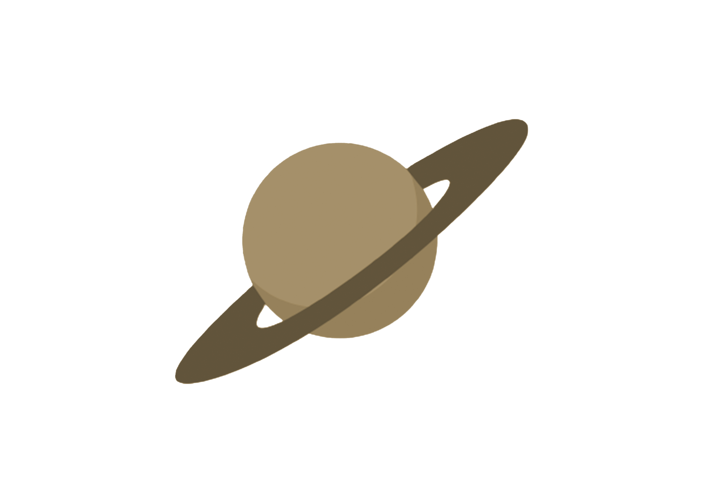
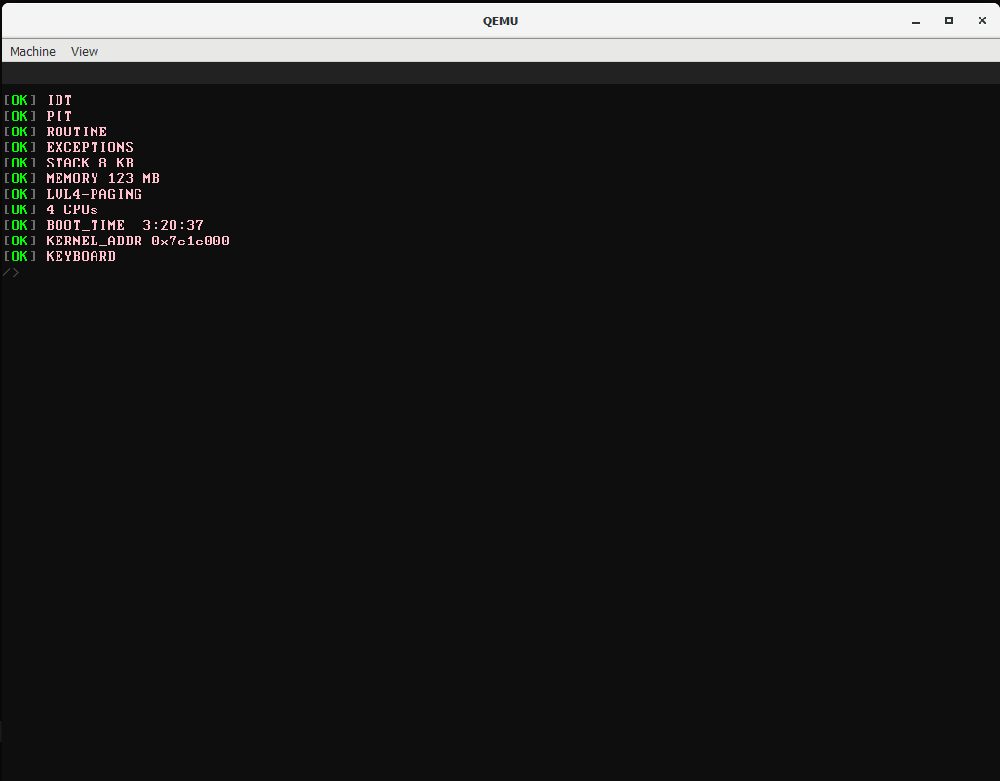

<h1 align="center" style="font-size: 50px">Saturn9</h1>

    

<h2 align="center">
    A Freestanding Kernel made in C with ♥
</h2>

    
    &nbsp;&nbsp;&nbsp;&nbsp;
    
    &nbsp;&nbsp;&nbsp;&nbsp;
    

<h1 align="center">Roadmap</h1>
<h4 align="center">In Implementation Order</h4>

- [x] Limine bootloader
- [x] VBE Graphics
- [x] Interrupts
- [x] PS/2 Keyboard
- [x] GDT
- [ ] TSS (may ignore for now)
- [ ] Filesystem/VFS
- [ ] Initramfs
- [ ] IO libc
- [ ] Direct Kernel Access Programming Language
- [ ] Mouse
- [ ] GUI

<h1 align="center">Preview</h1>

